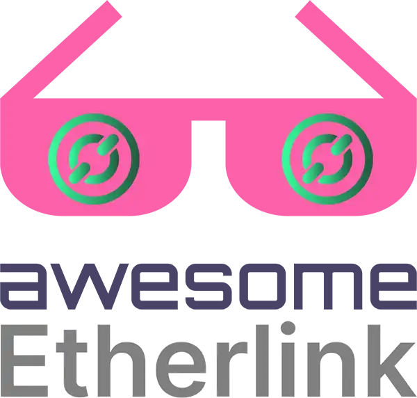

# Awesome Etherlink 

> A curated list of Etherlink Ecosystem dApps, tools, and communities.

---

## Support

This list is maintained by passionate Etherlink enthusiasts and supported with special thanks by:
		 
		 
		<a href="https://mylynx.xyz">
			
             
            MyLynx
		</a>
		 
		 

> If you would like to pledge support and have your project featured here, please [submit an issue](https://github.com/skullzarmy/awesome-etherlink/issues/new/choose).

You too can support this list by sending donations to
 
Tezos: <code>tz1Qi77tcJn9foeHHP1QHj6UX1m1vLVLMbuY</code>
 
Etherlink / Ethereum / Base: <code>0xE584554EAc158cEf865A6a52BF0E97C8dDf67eB5</code>

	Just type <a href="https://mylynx.xyz/etherlink"><code>mylynx.xyz/etherlink</code></a> to go here.

## Contents

-   [Support](#support)
-   [Block Explorers](#block-explorers)
-   [Bridges](#bridges)
    -   [Trackers](#trackers)
-   [DeFi](#defi)
    -   [Swap/LP](#swap-and-liquidity-pool)
    -   [Tokens](#tokens)
-   [Development](#development)
    -   [Boilerplates](#boilerplates)
    -   [Tooling](#tooling)
-   [Documentation](#documentation)
-   [Contribute](#contribute)

## Block Explorers

View realtime and historical block data

-   [Official Explorer](https://explorer.etherlink.com/)
    > \*(previously blockscout) URL has been updated

## Bridges

Crypto onramps to Etherlink

-   [Etherlink Bridge](https://bridge.etherlink.com/)
-   [Etherlink Testnet Bridge](https://bridge-xi.vercel.app/)

### Trackers

-   [Bridge Tracker](https://github.com/skenaja/etherlink-bridge-tracker)

## DeFi

Decentralized finance on Etherlink

### Swap and Liquidity Pool

-   [Tachyswap](https://tachyswap.org/)

### Tokens

-   [Degenerator.wtf](https://www.degenerator.wtf/)
-   [OrganicGrowth.wtf](https://www.organicgrowth.wtf/)

## Development

### Boilerplates

-   [BakingBad FA Token Bridge Boilerplate](https://github.com/baking-bad/etherlink-bridge)

### Tooling

-   [Thirdweb](https://thirdweb.com/)
-   [Redstone](https://redstone.finance/)
-   [Pyth](https://pyth.network/) (IN PROGRESS)
-   [Subsquid](https://subsquid.io/)
-   [The Graph](https://thegraph.com/)
-   [LayerZero](https://layerzero.network/)
-   [Fireblocks](https://www.fireblocks.com/) (Only mainnet)
-   [OnChainVision Labs](https://www.ocvlabs.com/)
-   [Tenderly](https://tenderly.co/) (IN PROGRESS)

More to come...

## Documentation

-   [Etherlink Docs](https://docs.etherlink.com/)

## NFTs

-   [BLTNFT.xyz](https://bltnft.xyz/)
    > Buy and sell your BLTNFT ingredients, accumulate MAYO, and soon assemble your BLTNFT!

## Contribute

Contributions welcome! Read the [contribution guidelines](contributing.md) first.
